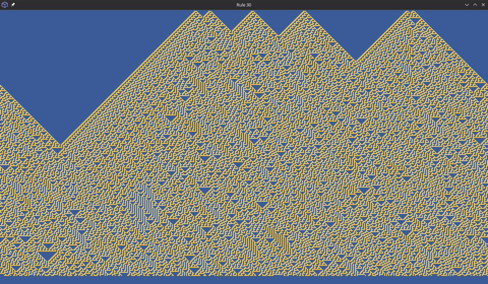

# Rule 30
## Introduction

Rule 30 is an elementary celluluar automaton introduced by Stephen Wolfram in 1983. 

The corresponding formula is really simple: [left_cell XOR (central_cell OR right_cell)].

Canonically, Rule 30 has one seed from the middle of the top margin, but I decided to add several random seeds, all interacting with each other. Additionally, it has wrap around, as can be seen.


## How to run it
You need Poetry (look [here](https://python-poetry.org) for more instructions), as well as Pyxel.

Once you have Poetry set up, the process is easy:
```shell
poetry env use python3.11
poetry install
poetry run python ./main.py
```

TODO: add CLI arguments to control the behaviour.